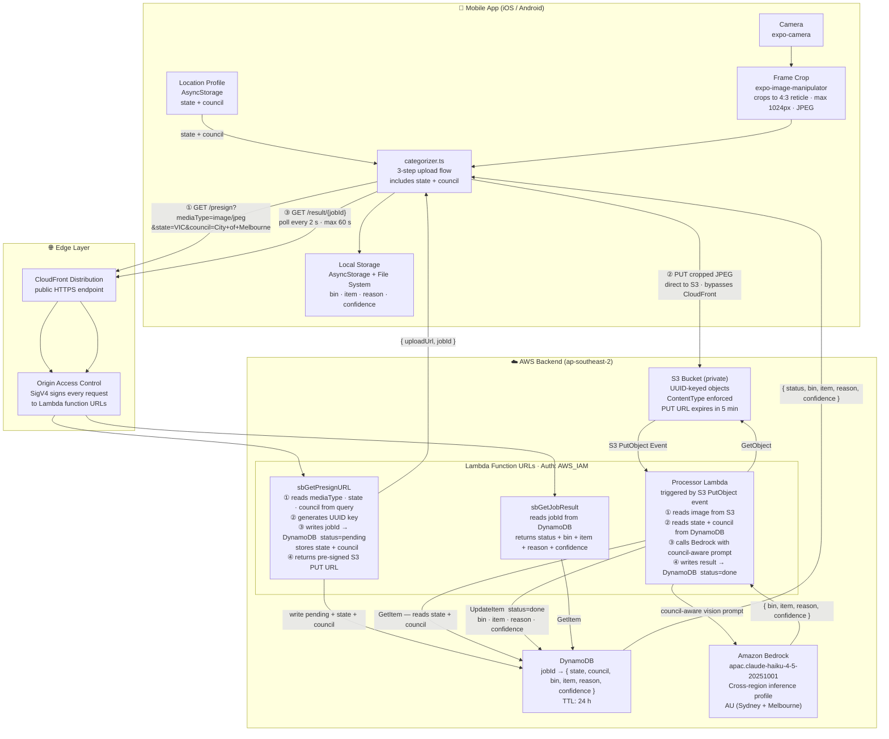
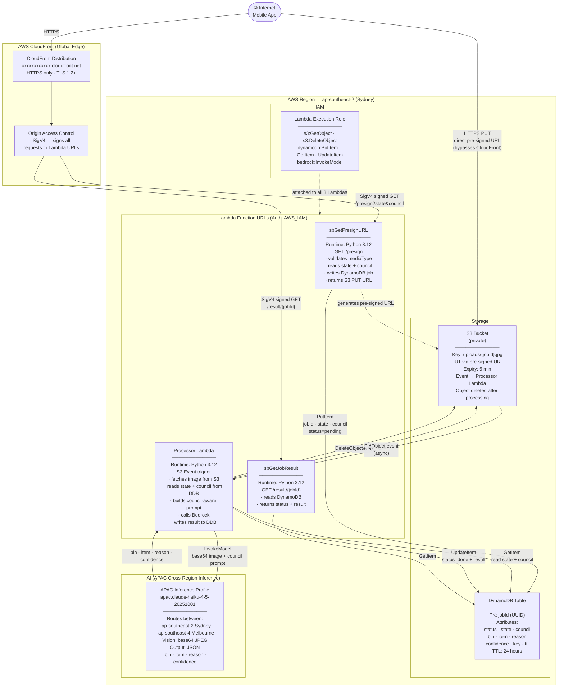
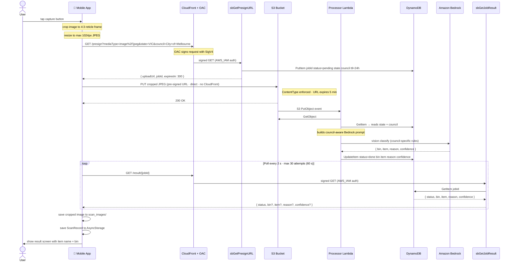

# SecureBin

A cross-platform mobile app (iOS + Android) that uses the device camera to photograph waste items and classifies which bin they belong to using Amazon Bedrock's vision AI. Advice is tailored to the user's **state and council** for accurate, location-specific bin guidance. No login required. Scan history is stored locally on the device.

---

## Architecture



---

## AWS Infrastructure



---

## Request Flow (Sequence)



---

## Bin Categories

| Bin | Colour | Category | Items |
|-----|--------|----------|-------|
| `red` | `#F44336` | General Waste / Landfill | Contaminated packaging, nappies, broken ceramics, soft plastics (most councils) |
| `yellow` | `#FFC107` | Mixed Recycling | Clean paper, cardboard, hard plastics, cans, glass (where no separate glass bin) |
| `green` | `#4CAF50` | Organics / FOGO | Food scraps, garden waste, grass clippings, uncoated paper towels |
| `white` | `#FFFFFF` | Glass Only | Glass bottles & jars — kerbside glass-only stream (select councils, CDS SA/NT) |
| `purple` | `#9C27B0` | Glass (AS4123) | Newer kerbside glass bin rolling out in Victoria (CRS) and parts of NSW |
| `blue` | `#2196F3` | Drop-Off Required | E-waste, batteries, soft plastics, chemicals — not kerbside, take to collection point |
| `orange` | `#FF9800` | Reuse / Donate | Clothes, working electronics, furniture, books — charity bin or op shop |
| `grey` | `#9E9E9E` | Unsure / Ask Council | Classification ambiguous — check with your local council |

---

## Tech Stack

| Layer | Technology |
|-------|-----------|
| Framework | React Native via Expo SDK 54 |
| Navigation | Expo Router (file-based stack) |
| Camera | `expo-camera` |
| Image processing | `expo-image-manipulator` — crop to reticle + resize |
| UI effects | `expo-blur` — frosted glass panels (UIVisualEffectView on iOS) |
| Local storage | `@react-native-async-storage/async-storage` + `expo-file-system/next` |
| Edge | AWS CloudFront + Origin Access Control (OAC) |
| API | AWS Lambda function URLs (Auth: AWS_IAM) |
| Storage | AWS S3 (private bucket) |
| Database | AWS DynamoDB (TTL 24 h) |
| AI | Amazon Bedrock — `apac.anthropic.claude-haiku-4-5-20251001` (APAC cross-region inference) |
| Language | TypeScript |

---

## Project Structure

```
SecureBin/
├── app/
│   ├── _layout.tsx        # Root stack navigator
│   ├── index.tsx          # Camera capture screen (home)
│   ├── setup.tsx          # First-run + location settings screen
│   ├── result.tsx         # Bin classification result screen
│   └── history.tsx        # Local scan history screen
├── components/
│   ├── BinResult.tsx      # Coloured bin card — shows item name + bin + reason
│   └── HistoryItem.tsx    # Single row in history list
├── services/
│   ├── categorizer.ts     # Crop → resize → S3 upload → poll result
│   ├── history.ts         # AsyncStorage + file system CRUD
│   └── location.ts        # State + council AsyncStorage persistence
├── hooks/
│   ├── useCamera.ts       # Camera permission + capture (returns width/height)
│   └── useHistory.ts      # Scan history state management
├── constants/
│   ├── bins.ts            # Bin definitions (color, label, examples)
│   └── councils.ts        # All Australian LGAs by state (ACT/NSW/VIC/QLD/SA/WA/TAS/NT)
├── types/
│   └── index.ts           # BinCategory · ScanRecord · CategorizationResult
├── test/
│   └── images/            # 10 sample waste images for pipeline testing
├── app.json               # Expo config — camera permissions
└── .env.example           # Environment variable template
```

---

## API Endpoints

All endpoints sit behind the same CloudFront distribution. CloudFront OAC signs requests to Lambda function URLs using SigV4.

| Endpoint | Method | Params | Response |
|----------|--------|--------|----------|
| `/presign` | GET | `mediaType`, `state`, `council` (query) | `{ uploadUrl, jobId, expiresIn }` |
| S3 pre-signed URL | PUT | raw JPEG bytes (body) | HTTP 200 |
| `/result/{jobId}` | GET | path | `{ status, bin?, item?, reason?, confidence?, error? }` |

---

## Location-Aware Advice

On first launch the app prompts the user to select their **state/territory** and **council**. This is persisted in AsyncStorage and sent with every `/presign` request:

```
GET /presign?mediaType=image/jpeg&state=VIC&council=City+of+Melbourne
```

`sbGetPresignURL` stores `state` and `council` in DynamoDB alongside the job. The Processor Lambda reads them back before calling Bedrock and builds a council-specific prompt:

```
The user is in City of Melbourne, VIC, Australia.
Apply City of Melbourne's specific bin collection rules where known.
```

The user can update their location at any time via the **Settings** button on the camera screen.

---

## Environment Setup

```bash
cp .env.example .env
```

`.env.example`:
```
EXPO_PUBLIC_API_BASE_URL=https://xxxxxxxx.cloudfront.net
```

---

## Commands

```bash
# Install dependencies
npm install

# Start Expo dev server
npx expo start

# Run on iOS simulator
npx expo run:ios

# Run on Android device / emulator
npx expo run:android

# Type check
npx tsc --noEmit
```

---

## Testing

`postbin.py` exercises the full AWS backend pipeline from the command line, including location-aware categorization:

```bash
# Install dependencies
pip install requests pillow

# Basic test (no location)
python postbin.py test/images/plastic_bottle.jpg

# With state + council (tests location-aware Bedrock prompt)
python postbin.py test/images/plastic_bottle.jpg \
  --state VIC \
  --council "City of Melbourne"

# Override the CloudFront base URL
python postbin.py test/images/banana_peel.jpg \
  --state NSW \
  --council "City of Sydney" \
  --base-url https://xxxx.cloudfront.net
```

Test images covering all bin categories live in `test/images/`.

---

## Platform Notes

- Camera permissions declared in `app.json` under `ios.infoPlist` and via the `expo-camera` plugin for Android
- `android.minSdkVersion` set to `24` (required for camera2 API)
- `RECORD_AUDIO` intentionally omitted — SecureBin never records audio
- `scheme` set to `"securebin"` in `app.json` — required by Expo Router for deep-linking in production builds
- Captured image is **cropped to the 4:3 reticle frame** before upload — only what the user frames is sent to Bedrock
- Images downscaled to max 1024px wide before upload to control latency and Bedrock cost
- Scan images stored in the app's document directory (`scan_images/`) — persist across restarts, cleared when user taps "Clear All History"
- `expo-blur` uses `UIVisualEffectView` on iOS for native glass blur; uses `RenderEffect` on Android
- The `confidence` value is stored in DynamoDB and used internally but not shown to the user — the identified **item name** is displayed instead
