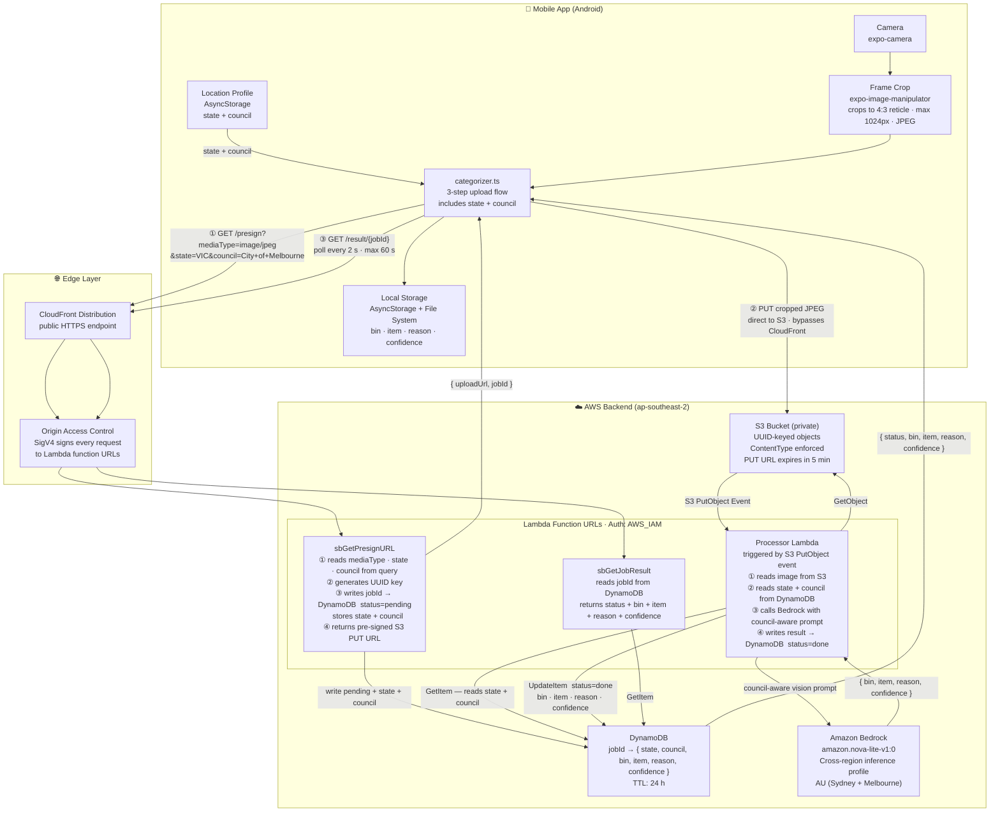
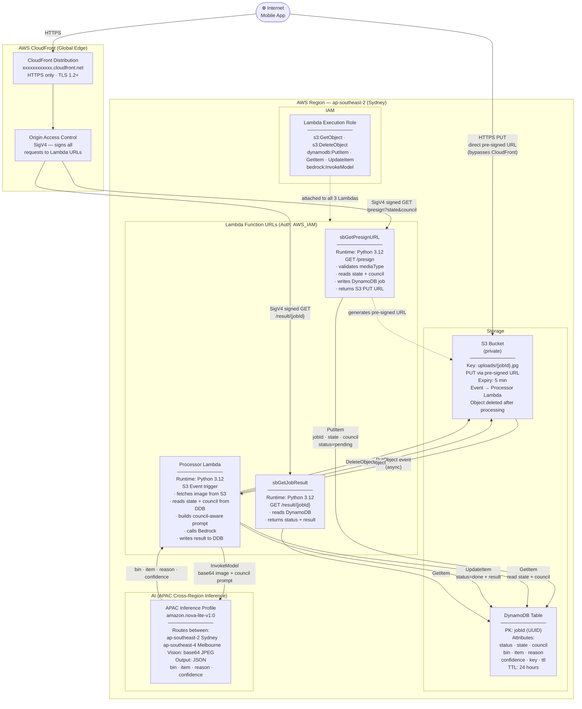
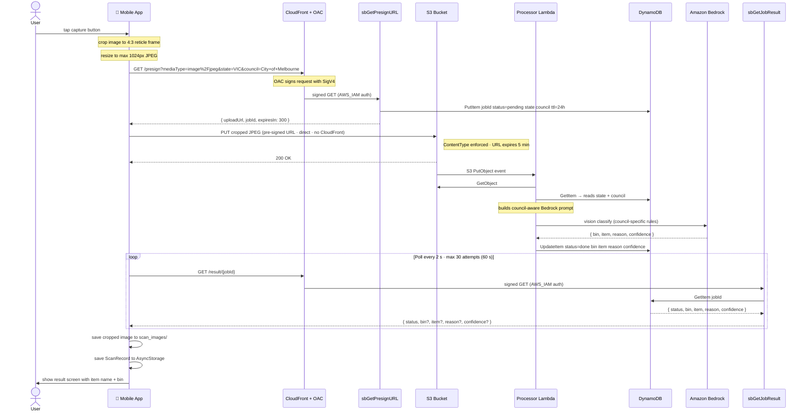

# SecureBin

An Android mobile app that uses the device camera to photograph waste items and classifies which bin they belong to using Amazon Bedrock's vision AI. Advice is tailored to the user's **state and council** for accurate, location-specific bin guidance. No login required. Scan history is stored locally on the device.

---

## Architecture


```mermaid
flowchart TD
    subgraph App["📱 Mobile App (Android)"]
        Camera["Camera\nexpo-camera"]
        Crop["Frame Crop\nexpo-image-manipulator\ncrops to 4:3 reticle · max 1024px · JPEG"]
        Cat["categorizer.ts\n3-step upload flow\nincludes state + council"]
        Store["Local Storage\nAsyncStorage + File System\nbin · item · reason · confidence"]
        Location["Location Profile\nAsyncStorage\nstate + council"]
    end

    subgraph Edge["🌐 Edge Layer"]
        CF["CloudFront Distribution\npublic HTTPS endpoint"]
        OAC["Origin Access Control\nSigV4 signs every request\nto Lambda function URLs"]
    end

    subgraph Backend["☁️ AWS Backend  (ap-southeast-2)"]
        subgraph Fns["Lambda Function URLs  ·  Auth: AWS_IAM"]
            PLambda["sbGetPresignURL\n① reads mediaType · state · council from query\n② generates UUID key\n③ writes jobId → DynamoDB  status=pending\n   stores state + council\n④ returns pre-signed S3 PUT URL"]
            RLambda["sbGetJobResult\nreads jobId from DynamoDB\nreturns status + bin + item + reason + confidence"]
            ProcLambda["Processor Lambda\ntriggered by S3 PutObject event\n① reads image from S3\n② reads state + council from DynamoDB\n③ calls Bedrock with council-aware prompt\n④ writes result → DynamoDB  status=done"]
        end

        S3["S3 Bucket  (private)\nUUID-keyed objects\nContentType enforced\nPUT URL expires in 5 min"]
        DDB["DynamoDB\njobId → { state, council, bin, item, reason, confidence }\nTTL: 24 h"]
        Bedrock["Amazon Bedrock\namazon.nova-lite-v1:0\nCross-region inference profile\nAU (Sydney + Melbourne)"]
    end

    Location -->|"state + council"| Cat
    Camera --> Crop --> Cat

    Cat -->|"① GET /presign?mediaType=image/jpeg\n&state=VIC&council=City+of+Melbourne"| CF
    CF --> OAC --> PLambda
    PLambda -->|"write pending + state + council"| DDB
    PLambda -->|"{ uploadUrl, jobId }"| Cat

    Cat -->|"② PUT cropped JPEG\ndirect to S3 · bypasses CloudFront"| S3

    S3 -->|"S3 PutObject Event"| ProcLambda
    ProcLambda -->|"GetObject"| S3
    ProcLambda -->|"GetItem — reads state + council"| DDB
    ProcLambda -->|"council-aware vision prompt"| Bedrock
    Bedrock -->|"{ bin, item, reason, confidence }"| ProcLambda
    ProcLambda -->|"UpdateItem  status=done\nbin · item · reason · confidence"| DDB

    Cat -->|"③ GET /result/{jobId}\npoll every 2 s · max 60 s"| CF
    CF --> OAC --> RLambda
    RLambda -->|"GetItem"| DDB
    DDB -->|"{ status, bin, item, reason, confidence }"| Cat

    Cat --> Store
```

---

## AWS Infrastructure


```mermaid
flowchart TB
    Internet(["🌐 Internet\nMobile App"])

    subgraph CDN["AWS CloudFront  (Global Edge)"]
        direction TB
        CF["CloudFront Distribution\nxxxxxxxxxxxx.cloudfront.net\nHTTPS only · TLS 1.2+"]
        OAC["Origin Access Control\nSigV4 — signs all\nrequests to Lambda URLs"]
        CF --> OAC
    end

    subgraph Region["AWS Region — ap-southeast-2  (Sydney)"]
        direction TB

        subgraph Lambdas["Lambda Function URLs  (Auth: AWS_IAM)"]
            direction LR
            PL["sbGetPresignURL\n─────────────\nRuntime: Python 3.12\nGET /presign\n· validates mediaType\n· reads state + council\n· writes DynamoDB job\n· returns S3 PUT URL"]
            RL["sbGetJobResult\n─────────────\nRuntime: Python 3.12\nGET /result/{jobId}\n· reads DynamoDB\n· returns status + result"]
            PROC["Processor Lambda\n─────────────\nRuntime: Python 3.12\nS3 Event trigger\n· fetches image from S3\n· reads state + council from DDB\n· builds council-aware prompt\n· calls Bedrock\n· writes result to DDB"]
        end

        subgraph Storage["Storage"]
            direction LR
            S3["S3 Bucket\n(private)\n─────────────\nKey: uploads/{jobId}.jpg\nPUT via pre-signed URL\nExpiry: 5 min\nEvent → Processor Lambda\nObject deleted after processing"]
            DDB["DynamoDB Table\n─────────────\nPK: jobId  (UUID)\nAttributes:\n  status · state · council\n  bin · item · reason\n  confidence · key · ttl\nTTL: 24 hours"]
        end

        subgraph AI["AI  (APAC Cross-Region Inference)"]
            APAC["APAC Inference Profile\namazon.nova-lite-v1:0\n─────────────\nRoutes between:\n  ap-southeast-2 Sydney\n  ap-southeast-4 Melbourne\nVision: base64 JPEG\nOutput: JSON\n  bin · item · reason · confidence"]
        end

        subgraph IAM["IAM"]
            ROLE["Lambda Execution Role\n─────────────\ns3:GetObject · s3:DeleteObject\ndynamodb:PutItem · GetItem · UpdateItem\nbedrock:InvokeModel"]
        end
    end

    Internet -->|"HTTPS"| CF
    OAC -->|"SigV4 signed GET\n/presign?state&council"| PL
    OAC -->|"SigV4 signed GET\n/result/{jobId}"| RL

    Internet -->|"HTTPS PUT\ndirect pre-signed URL\n(bypasses CloudFront)"| S3

    PL -->|"PutItem\njobId · state · council\nstatus=pending"| DDB
    PL -.->|"generates pre-signed URL"| S3

    S3 -->|"PutObject event\n(async)"| PROC
    PROC -->|"GetObject"| S3
    PROC -->|"GetItem\nread state + council"| DDB
    PROC -->|"InvokeModel\nbase64 image + council prompt"| APAC
    APAC -->|"bin · item · reason · confidence"| PROC
    PROC -->|"UpdateItem\nstatus=done + result"| DDB
    PROC -->|"DeleteObject"| S3

    RL -->|"GetItem"| DDB

    ROLE -.->|"attached to all 3 Lambdas"| Lambdas
```

---

## Request Flow (Sequence)


```mermaid
sequenceDiagram
    actor User
    participant App as 📱 Mobile App
    participant CF as CloudFront + OAC
    participant PL as sbGetPresignURL
    participant S3 as S3 Bucket
    participant Proc as Processor Lambda
    participant DB as DynamoDB
    participant BR as Amazon Bedrock
    participant RL as sbGetJobResult

    User->>App: tap capture button

    Note over App: crop image to 4:3 reticle frame
    Note over App: resize to max 1024px JPEG

    App->>CF: GET /presign?mediaType=image%2Fjpeg&state=VIC&council=City+of+Melbourne
    Note over CF: OAC signs request with SigV4
    CF->>PL: signed GET (AWS_IAM auth)
    PL->>DB: PutItem  jobId  status=pending  state  council  ttl=24h
    PL-->>App: { uploadUrl, jobId, expiresIn: 300 }

    App->>S3: PUT cropped JPEG  (pre-signed URL · direct · no CloudFront)
    Note right of S3: ContentType enforced · URL expires 5 min
    S3-->>App: 200 OK

    S3->>Proc: S3 PutObject event
    Proc->>S3: GetObject
    Proc->>DB: GetItem → reads state + council
    Note over Proc: builds council-aware Bedrock prompt
    Proc->>BR: vision classify (council-specific rules)
    BR-->>Proc: { bin, item, reason, confidence }
    Proc->>DB: UpdateItem  status=done  bin  item  reason  confidence

    loop Poll every 2 s · max 30 attempts (60 s)
        App->>CF: GET /result/{jobId}
        CF->>RL: signed GET (AWS_IAM auth)
        RL->>DB: GetItem  jobId
        DB-->>RL: { status, bin, item, reason, confidence }
        RL-->>App: { status, bin?, item?, reason?, confidence? }
    end

    App->>App: save cropped image to scan_images/
    App->>App: save ScanRecord to AsyncStorage
    App->>User: show result screen with item name + bin
```

---

## Bin Categories

| Bin | Colour | Category | Items |
|-----|--------|----------|-------|
| `red` | `#F44336` | General Waste / Landfill | Contaminated packaging, nappies, broken ceramics, soft plastics (most councils) |
| `yellow` | `#FFC107` | Mixed Recycling | Clean paper, cardboard, hard plastics, cans, glass (where no separate glass bin) |
| `green` | `#4CAF50` | Organics / FOGO | Food scraps, garden waste, grass clippings, uncoated paper towels |
| `white` | `#FFFFFF` | Glass Only | Glass bottles & jars — kerbside glass-only stream (select councils, CDS SA/NT) |
| `purple` | `#9C27B0` | Glass (AS4123) | Newer kerbside glass bin rolling out in Victoria (CRS) and parts of NSW |
| `blue` | `#2196F3` | Drop-Off Required | E-waste, batteries, soft plastics, chemicals — not kerbside, take to collection point |
| `orange` | `#FF9800` | Reuse / Donate | Clothes, working electronics, furniture, books — charity bin or op shop |
| `grey` | `#9E9E9E` | Unsure / Ask Council | Classification ambiguous — check with your local council |

---

## Tech Stack

| Layer | Technology |
|-------|-----------|
| Framework | React Native via Expo SDK 54 |
| Navigation | Expo Router (file-based stack) |
| Camera | `expo-camera` |
| Image processing | `expo-image-manipulator` — crop to reticle + resize |
| UI effects | `expo-blur` — frosted glass panels (RenderEffect on Android) |
| Local storage | `@react-native-async-storage/async-storage` + `expo-file-system/next` |
| Edge | AWS CloudFront + Origin Access Control (OAC) |
| API | AWS Lambda function URLs (Auth: AWS_IAM) |
| Storage | AWS S3 (private bucket) |
| Database | AWS DynamoDB (TTL 24 h) |
| AI | Amazon Bedrock — `amazon.nova-lite-v1:0` |
| Language | TypeScript |

---

## Project Structure

```
SecureBin/
├── app/
│   ├── _layout.tsx        # Root stack navigator
│   ├── index.tsx          # Camera capture screen (home)
│   ├── setup.tsx          # First-run + location settings screen
│   ├── result.tsx         # Bin classification result screen
│   └── history.tsx        # Local scan history screen
├── components/
│   ├── BinResult.tsx      # Coloured bin card — shows item name + bin + reason
│   └── HistoryItem.tsx    # Single row in history list
├── services/
│   ├── categorizer.ts     # Crop → resize → S3 upload → poll result
│   ├── history.ts         # AsyncStorage + file system CRUD
│   └── location.ts        # State + council AsyncStorage persistence
├── hooks/
│   ├── useCamera.ts       # Camera permission + capture (returns width/height)
│   └── useHistory.ts      # Scan history state management
├── constants/
│   ├── bins.ts            # Bin definitions (color, label, examples)
│   └── councils.ts        # All Australian LGAs by state (ACT/NSW/VIC/QLD/SA/WA/TAS/NT)
├── types/
│   └── index.ts           # BinCategory · ScanRecord · CategorizationResult
├── test/
│   └── images/            # 10 sample waste images for pipeline testing
├── app.json               # Expo config — camera permissions
└── .env.example           # Environment variable template
```

---

## API Endpoints

All endpoints sit behind the same CloudFront distribution. CloudFront OAC signs requests to Lambda function URLs using SigV4.

| Endpoint | Method | Params | Response |
|----------|--------|--------|----------|
| `/presign` | GET | `mediaType`, `state`, `council` (query) | `{ uploadUrl, jobId, expiresIn }` |
| S3 pre-signed URL | PUT | raw JPEG bytes (body) | HTTP 200 |
| `/result/{jobId}` | GET | path | `{ status, bin?, item?, reason?, confidence?, error? }` |

---

## Location-Aware Advice

On first launch the app prompts the user to select their **state/territory** and **council**. This is persisted in AsyncStorage and sent with every `/presign` request:

```
GET /presign?mediaType=image/jpeg&state=VIC&council=City+of+Melbourne
```

`sbGetPresignURL` stores `state` and `council` in DynamoDB alongside the job. The Processor Lambda reads them back before calling Bedrock and builds a council-specific prompt:

```
The user is in City of Melbourne, VIC, Australia.
Apply City of Melbourne's specific bin collection rules where known.
```

The user can update their location at any time via the **Settings** button on the camera screen.

---

## Environment Setup

```bash
cp .env.example .env
```

`.env.example`:
```
EXPO_PUBLIC_API_BASE_URL=https://xxxxxxxx.cloudfront.net
```

The real value lives in SSM, one per environment. `services/categorizer.ts`
throws at import if it is missing, so the app cannot start without it:

```bash
aws ssm get-parameter --region ap-southeast-2 \
  --name /securebin/prod/api-base-url --query Parameter.Value --output text
```

`npx expo start` runs in development mode and reads `.env.development`, not
`.env.production`. `EXPO_PUBLIC_*` values are inlined at bundle time, so restart
Metro with `--clear` after changing them.

### Local build prerequisites

A clone cannot build until these exist; none are in the repo.

| Requirement | Notes |
|---|---|
| JDK 17 | `brew install openjdk@17`. Keg-only, so set `JAVA_HOME=/opt/homebrew/opt/openjdk@17` — it will not appear on `PATH` or in `java_home` by itself. |
| Android SDK | platform 36, build-tools 36.0.0, NDK 27.1.12297006, CMake 3.22.1. Point Gradle at it with `android/local.properties` containing `sdk.dir=$HOME/Library/Android/sdk`. |
| `android/app/debug.keystore` | Gitignored, and `:app:validateSigningDebug` fails without it. Generate the standard debug key — the credentials below are Android's published defaults, already hardcoded in `android/app/build.gradle`. |

```bash
keytool -genkeypair -v -storetype PKCS12 \
  -keystore android/app/debug.keystore -alias androiddebugkey \
  -storepass android -keypass android -keyalg RSA -keysize 2048 -validity 10000 \
  -dname "CN=Android Debug,O=Android,C=US"
```

A debug build loads its JavaScript from Metro, so the device needs
`adb reverse tcp:8081 tcp:8081` and the cable connected. Building one ABI
(`-PreactNativeArchitectures=arm64-v8a`) is much faster for device testing.

---

## Commands

```bash
# Install dependencies
npm install

# Start Expo dev server
npx expo start

# Run on Android device / emulator
npx expo run:android

# Type check
npx tsc --noEmit
```

---

## Testing

`test/testbin.py` exercises the full AWS backend pipeline (presign → S3 upload → poll) from the command line, including location-aware categorization:

```bash
# Install dependencies
pip install requests pillow

# Basic test (no location)
python test/testbin.py test/images/plastic_bottle.jpg \
  --base-url https://xxxx.cloudfront.net

# With state + council (tests location-aware Bedrock prompt)
python test/testbin.py test/images/plastic_bottle.jpg \
  --base-url https://xxxx.cloudfront.net \
  --state VIC \
  --council "City of Melbourne"

# Or set the base URL via environment variable
export SECUREBIN_API_BASE_URL=https://xxxx.cloudfront.net
python test/testbin.py test/images/banana_peel.jpg \
  --state NSW \
  --council "City of Sydney Council"
```

Test images covering all bin categories live in `test/images/`.

---

## CI / CD (AWS CodePipeline)

CI builds; releasing is manual. The pipeline is defined in `infra/ci-cd.yaml`
and connects to GitHub through an AWS CodeConnection. Two stages:

1. **Source** — pulls the commit from GitHub via CodeConnections.
2. **Build** — runs the Lambda unit tests, builds a signed release AAB, deploys
   the website to S3 and invalidates CloudFront.

The build action receives `BRANCH_NAME` from the source action, which decides
production vs development. CodeBuild's own `CODEBUILD_SOURCE_VERSION` is an S3
artifact ARN under CodePipeline and can never identify the branch.

### Releasing to Google Play

Automated publishing needs a Play service account key in SSM; it is deliberately
not set up, so the Play Console upload is done by hand. The AAB that CI produces
is signed with the real upload keystore and is publishable as-is.

```bash
# newest build artifact (a zip containing the AAB)
KEY=$(aws s3api list-objects-v2 --bucket securebin-cicd-artifactsbucket-n4rptpnw90ta \
  --prefix SecureBin-Pipeline/BuildArtif/ \
  --query "sort_by(Contents,&LastModified)[-1].Key" --output text)
aws s3 cp "s3://securebin-cicd-artifactsbucket-n4rptpnw90ta/$KEY" /tmp/securebin-build.zip
unzip -o /tmp/securebin-build.zip -d /tmp/securebin-aab && find /tmp/securebin-aab -name '*.aab'
```

Upload that file in the Play Console. Bump `version` and `android.versionCode`
in `app.json` before the build, or Play will reject the upload as a duplicate.

`buildspec-deploy.yml` holds the automated Fastlane path and is **not wired into
the pipeline**. Restoring it means adding a CodeBuild project and a Deploy stage
(see `24ec37e`) and creating `/securebin/google-play-service-account`. It has
never executed.

EventBridge & SNS are also configured to send email notifications on pipeline success/failure.

### Required AWS Secrets
The pipelines fetch the following from SSM Parameter Store as SecureStrings (under `/securebin/*`):
- `securebin/upload-keystore` (Base64 encoded `.jks` file)
- `securebin/upload-store-password`
- `securebin/upload-key-alias`
- `securebin/upload-key-password`

`securebin/google-play-service-account` is only needed if the automated Play
upload is restored; nothing reads it today.

### Dependency advisories

`npm audit` reports a few dozen advisories, and they are expected to stay. Every
leaf advisory is in build tooling — `@xmldom/xmldom`, `postcss`, `braces`,
`brace-expansion`, `image-size`, `node-forge`, `undici` — reached through
`@expo/cli`, `@expo/config-plugins` and Metro. None of it ships in the APK: the
bundle contains React Native, Hermes and the `expo-*` runtime modules only.

`npx expo install --check` reports the pinned versions are correct for SDK 54,
and npm's suggested remedies are semver-major, including *downgrading* `expo` to
44.0.6. Fixing these would move the toolchain off Expo's supported set to patch
code that never reaches a device. Revisit at the next SDK upgrade rather than
with `npm audit fix`.

> **Note:** The old GitHub Actions workflows have been removed to prevent duplicate runs. You must provision the AWS resources and populate the secrets for the CI/CD pipeline to function.

---

## Platform Notes

- Camera permissions declared in `app.json` under `android.permissions` and via the `expo-camera` plugin
- `android.minSdkVersion` set to `24` (required for camera2 API)
- `RECORD_AUDIO` intentionally omitted — SecureBin never records audio
- `scheme` set to `"securebin"` in `app.json` — required by Expo Router for deep-linking in production builds
- Captured image is **cropped to the 4:3 reticle frame** before upload — only what the user frames is sent to Bedrock
- Images downscaled to max 1024px wide before upload to control latency and Bedrock cost
- Scan images stored in the app's document directory (`scan_images/`) — persist across restarts, cleared when user taps "Clear All History"
- `expo-blur` uses `RenderEffect` on Android for native glass blur
- The `confidence` value is stored in DynamoDB and shown on the result screen as
  "AI Confidence: N%" (see `components/BinResult.tsx`), alongside the identified **item name**
- The user-supplied `state`/`council` pair is validated against the exact allowlist in
  `backend/lambda/shared/councils.py` before it reaches the Bedrock prompt. Regenerate that
  file with `python3 scripts/gen_councils.py` after editing `constants/councils.ts`, and
  include it in both Lambda deployment packages

---

## License

This project is licensed under the [MIT License](LICENSE).
